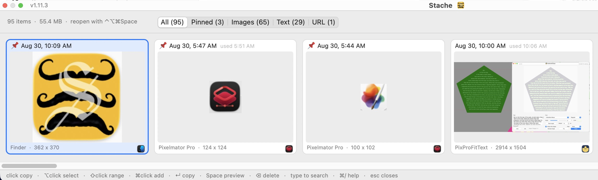

# Stache

Clipboard history for macOS.

### [⬇︎ Download the latest release](https://github.com/spurious-cox/stache/releases/latest)

Notarized and stapled by Apple — open the DMG and drag Stache to
Applications. No Gatekeeper warning, no permissions to grant.

**Updating: quit Stache first** (menu bar S → Quit). Force-quitting counts as
a crash, and the LaunchAgent will bring the old copy straight back.

A background agent records everything you copy, text and images alike, with
the time and the app it came from. A global hotkey raises a grid of what it
has kept; picking one puts it back on the clipboard.

The name is the joke: a *stache* is where you *stash* things.

    ⌃⌥⌘Space        open the picker

## Using it

No Dock icon and no window of its own — Stache lives in the menu bar, which
also lists the ten newest clippings (⌘1–⌘9 while it is open).

Three layouts, set in Preferences, each remembering its own size and place:

* **Strip** — one row above the Dock, scrolling sideways. The default.
* **Column** — one column up the left edge, scrolling vertically.
* **Grid** — a centred window, for looking through the whole history.

| | |
|---|---|
| click a card | copy it — the picker stays up and says so |
| ⌥-click | select without copying |
| ⇧-click | extend the selection |
| ⌘-click | add or remove one card |
| right-click | Quick Look · Copy · Open · Open With ▸ · Reveal in Finder · Pin · Delete |
| arrows | move the selection |
| Return | copy the selected card |
| Space | Quick Look — text or image, follows the arrow keys |
| ⌫ | delete for good — asks once for more than one |
| type anything | jumps into the search field |
| ⌘0 | put the panel back where it belongs |
| ⌘/ | the full help |
| Esc | close, clipboard untouched |
| All / Pinned / Images / Text / URL | filter by kind, each chip carrying its count |

Picking does not close the picker and does not hand back the keyboard, so the
sequence is **pick, Esc, ⌘V**.

Drag the panel anywhere and resize it; the frame is saved per layout. One
dimension is fixed by the card — a strip's height, a column's width. ⌘0
forgets a dragged position, which matters if it was dragged to a display you
no longer have.

Search covers the text, the source app and the capture date. Dates can be
typed the way you say them: `today`, `last week`, `august`, `thursday`,
`8/28`, `2026`, `12:55 pm`. A **URL** is a text clipping whose whole body is
one link, and is not also counted as text.

## Opening and changing a clipping

A link opens in your browser; anything else is written to a real file and
opened by whatever handles it.

**Edit…** rewrites a pinned text clipping in place, and **Update From
Clipboard** replaces a pinned image. Both are pinned-only: an unpinned
clipping is subject to the retention limits, so the edit would not last.
A changed card shows **edited** beside its date.

## Pinning

A pinned clipping sorts first and is exempt from the item limit, the age
limit and Clear History. **It cannot be deleted while pinned** — unpin it
first. Deleting a mixed selection deletes the unpinned ones and says how many
it kept.

## Preferences

From the menu bar item, or ⌘, while Stache is frontmost.

* **Card size** — Large, Medium or Small. Thumbnails are rebuilt as needed.
* **Layout** — Strip, Column or Grid.
* **Strip size** — a percentage of the screen: a strip's width, a column's
  height.
* **Hotkey** — click the button and press the chord. At least one modifier.
* **Keep at most** *n* items (0 = no limit).
* **Delete after** *n* days (0 = never), counted from the last time you used
  a clipping. A card in the last tenth of its life says so in red.
* **Capture images as well as text.**
* **Open Stache at login** — installs a LaunchAgent, which launchd restarts
  if it dies.
* **Clear History…** — deletes every unpinned clipping and its image file.

Defaults: large cards, strip at 60%, ⌃⌥⌘Space, 500 items, 30 days, images on.

## Where the data lives

    ~/Library/Application Support/Stache/
        stache.sqlite3     the index and the text of every clipping
        blobs/             one PNG per image clipping
        thumbs/            its thumbnail

Image clippings are ordinary PNGs, so Open and Reveal in Finder work straight
from the picker. Nothing leaves the Mac, and nothing is encrypted — the
database is readable by anything running as you.

## What is not recorded

* Anything a password manager copies (the `org.nspasteboard.ConcealedType`
  marker, along with `TransientType` and `AutoGeneratedType`).
* Whatever arrives while **Pause Capturing** is on.
* Stache's own writes when you pick something.

Copying the same thing twice moves the existing entry back to the top rather
than making a second one.

## Permissions

None. The hotkey is a Carbon hot key, and writing to the pasteboard is
unprivileged. That is why picking a clipping copies rather than pressing ⌘V
for you — synthesising a keystroke would have required Accessibility.

## From the shell

`~/bin/stache` reads the same history:

    stache                 the 20 newest clippings, numbered
    stache list -n 50      more of them
    stache list safari     only clippings matching "safari"
    stache 3               print clipping 3
    stache copy 3          put clipping 3 on the clipboard
    stache path 3          the PNG behind an image clipping
    stache rm 3            delete clipping 3 (asks; --force skips)
    stache stats           how much history there is

Numbers match the app. The database is opened read-only except for `rm`, so
it is safe to run while the app is running.

## Building

    ./venv/bin/python test_stache.py      headless checks + test_render*.png
    ./build.sh                            build and sign into dist/
    ./build.sh --install                  also install to /Applications
    ./release.sh                          notarize app + DMG, staple, install

The version lives in one place — `APP_VERSION` in `stache.py`.

## Files

    stache.py           the whole app
    test_stache.py      headless checks and the panel render
    make_icon.py        builds icon/Stache.icns from the artwork
    icon/stache.pxd     the icon artwork (Pixelmator Pro master)
    setup.py            py2app bundle
    build.sh            build, sign, install
    release.sh          notarize and staple app + DMG
    ~/bin/stache        the command-line client (stdlib only, no venv)
    stache.entitlements hardened-runtime entitlements

© 2026 Tim McCoy.
